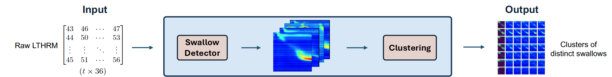

<div align="center">

<h2>A deep learning based approach to enhance accuracy and feasibility of long-term high-resolution manometry examinations</h2>

<div>
    <a href='https://web.med.tum.de/miti/personen/alexander-geiger/' target='_blank'>Alexander Geiger</a><sup>1</sup>&nbsp;
    <a href='https://web.med.tum.de/miti/personen/lars-wagner/' target='_blank'>Lars Wagner</a><sup>1</sup>&nbsp;
    <a href='https://aim-lab.io/author/daniel-ruckert/' target='_blank'>Daniel Rückert</a><sup>2,3</sup>&nbsp;
    <a href='https://www.chir.med.tum.de/personal/wilhelm' target='_blank'>Dirk Wilhelm</a><sup>1,4</sup>&nbsp;
    <a href='https://web.med.tum.de/miti/personen/alissa-jell/' target='_blank'>Alissa Jell</a><sup>1,4</sup>
</div>

<div>
    <sup>1</sup>Technical University of Munich, TUM School of Medicine and Health, Klinikum
rechts der Isar, Research Group MITI
</div>
<div>
    <sup>2</sup>Technical University of Munich, TUM School of Computation, Information and
Technology, Artificial Intelligence in Healthcare and Medicine
</div>
<div>
    <sup>3</sup>Imperial College London, Department of Computing
</div>
<div>
    <sup>4</sup>Technical University of Munich, TUM School of Medicine and Health, Klinikum
rechts der Isar, Department of Surgery
</div>

<div align="center">
    <h4>
        This repository performs swallow detection with Convolutional Neural Networks (CNN) such as MobileNet, GoogleNet, EfficientNet and RegNet as well as clustering of the detected swallows.
    </h4>
</div>
</div>

Link to paper: [**Detecting and clustering swallow events in esophageal long-term high-resolution manometry**](https://arxiv.org/pdf/2405.01126)



## References
```BibTeX
@article{geiger2024detecting,
  title     = {Detecting and clustering swallow events in esophageal long-term high-resolution manometry},
  author    = {Geiger, Alexander and Wagner, Lars and Rueckert, Daniel and Wilhelm, Dirk and Jell, Alissa},
  journal   = {arXiv preprint arXiv:2405.01126},
  year      = {2024}
}
```

## Data structure

```
-- swallow-detection (repo)
-- data
    |--anno (tensorname and label)
        |--patient_1.csv
        |--patient_2.csv
        |--...
    |--sensors (raw manometry data)
        |--manometry_1.csv/pickle
        |--manometry_2.csv/pickle
        |--...
    |--swallows (ground truth swallows)
        |--manometry_swallows_1.csv
        |--manometry_swallows_2.csv
        |--...
    |--tensors
        |--patient_1
            |--0.pt
            |--1.pt
            |--...
        |--patient_2
            |--0.pt
            |--1.pt
            |--...
    |--manometry
        |--patient_1
            |--0.pt
            |--1.pt
            |--...
        |--patient_2
            |--0.pt
            |--1.pt
            |--...
```


## Training and Inference

Run **MobileNet**, **GoogleNet**, **EfficientNet**, **RegNet** by placing in {}.
```
python train.py -c modules/cnn/config/congif_{}.yaml
```
